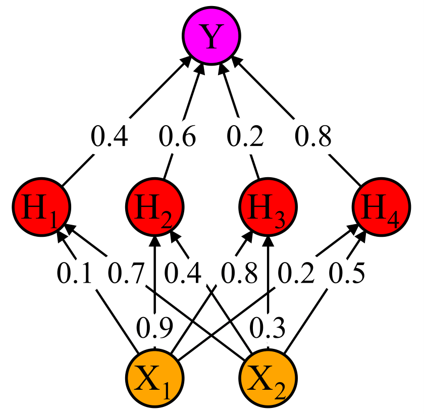
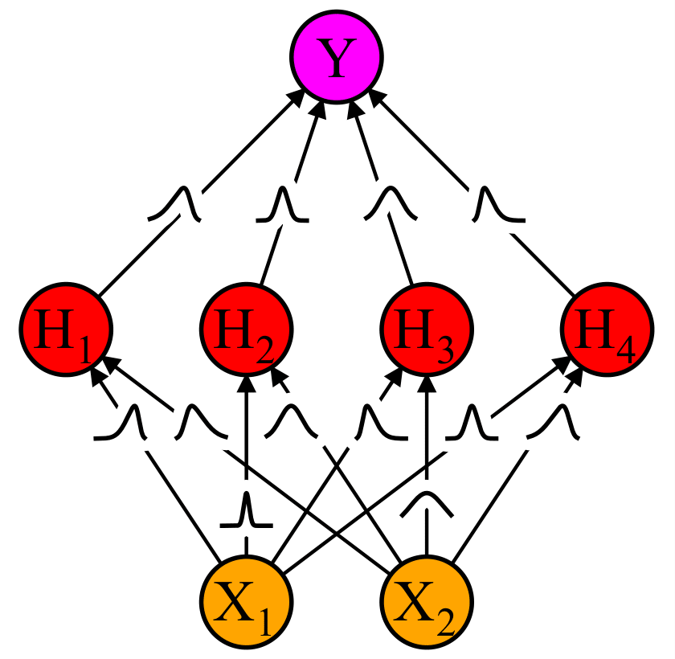
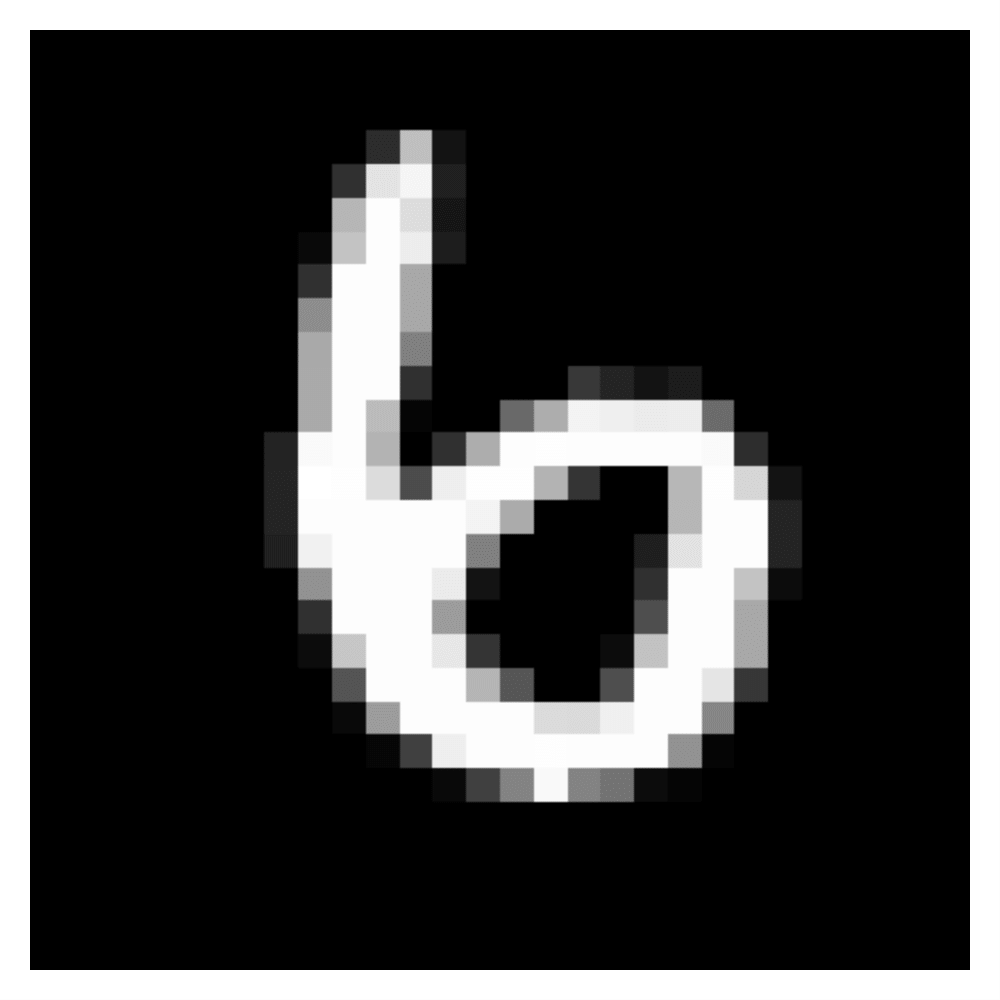
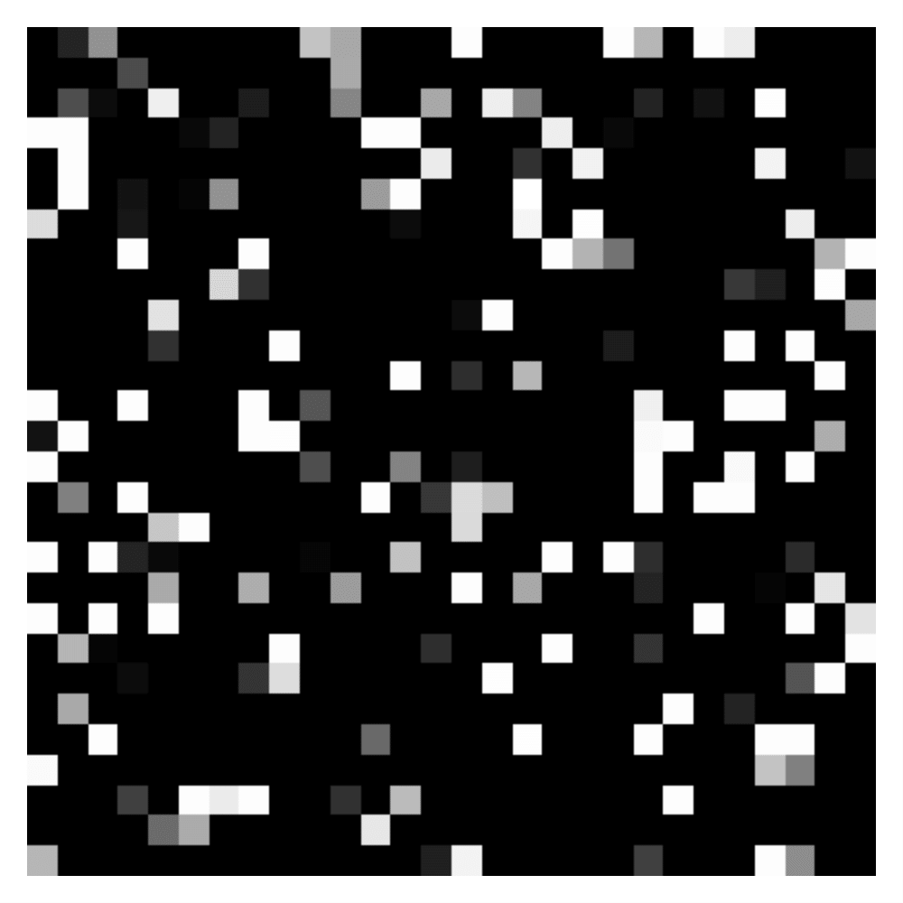
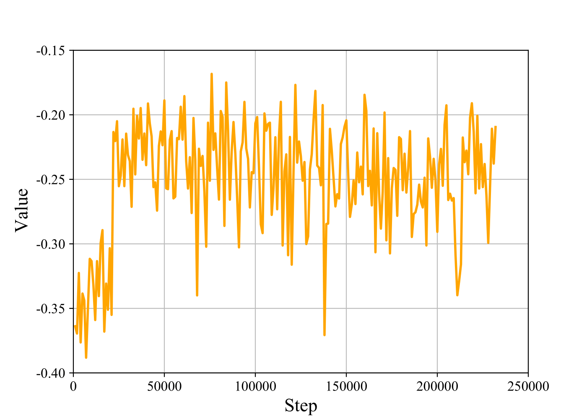
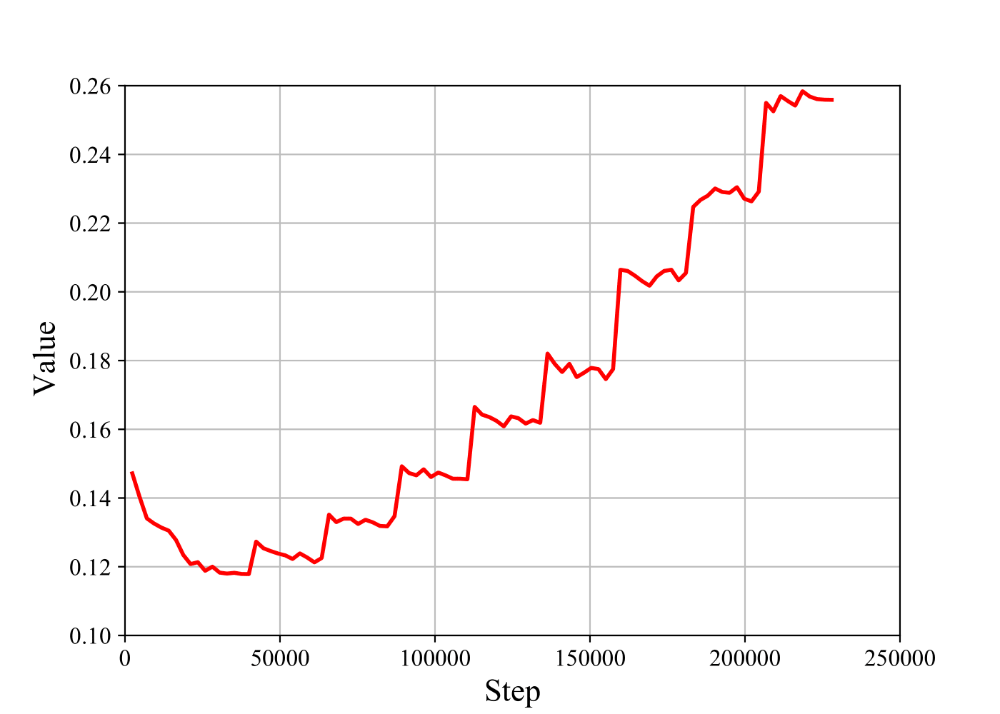
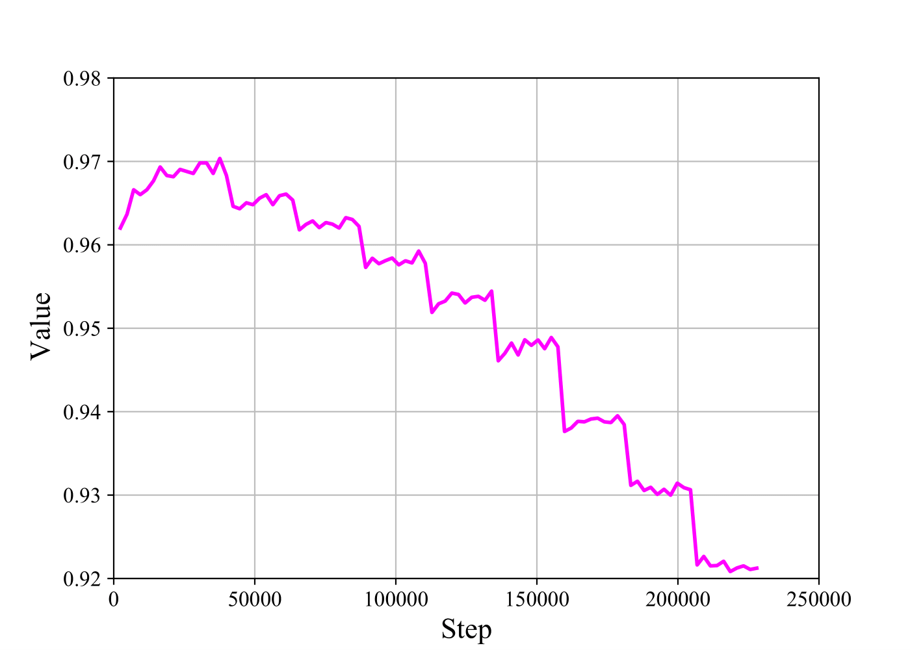

# Globally Induced Variational Continual Learning

The field of artificial intelligence has undergone a transformation and although significant progress has been realised, it still falls short of human intelligence most notably perhaps when it comes to continual learning. This is the ability to acquire knowledge not just of a single task but to accumulate knowledge from multiple sequential tasks, whilst only ever having access to the current task data. Variational continual learning implements this by leveraging the intrinsically continual process emerging from the recursive application of Bayesian inference, which combines what the current task data indicates about the model parameters, with what previous task data indicated about the model parameters. Combining this with Bayesian neural networks, which perform Bayesian inference over the model parameters, such that the wide variety of complex tasks solved by artificial neural networks, may also be solved in a continual setting. Typically exact inference can’t be performed and so an approximate inference scheme must be chosen. The objective of this project is to build on the work of variational continual learning, by merging it with the recent work of global inducing point variational inference. The hypothesis being that because global inducing points act as pseudo data points, they could behave as an episodic memory for the model and thereby increase performance. Extensive detail can be found in the associated dissertation [1](Dissertation.pdf).

### Theory

The extension of artificial neural networks from a frequentist scheme to a Bayesian scheme, with uncertainty in the model parameters by representing them not as point estimates but as probability distributions, produces a Bayesian neural network. Constructed through the fusion of Bayesian networks and artificial neural networks, the intention being to combine the probabilistic guarantees and continuous function approximation of each, into a single model. The mean field variational inference scheme used in the variational continual learning research papers, assumes that the joint distribution over the model parameters can be factorised out into independent distributions, thereby averaging over the degrees of freedom. In contrast the global inducing point variational inference scheme, defines a set of global inducing points, which act as pseudo data points in order to induce a distribution over the model parameters. A number of advantages arise from this inference scheme, the most significant of which is that it models cross layer correlations, as global inducing points are defined jointly for all layers, and therefore model not only the input to output transformation of individual layers but the input to output transformation of the whole network. Furthermore the model parameters are defined over function space rather than parameter space, which provides a more intuitive interpretation as it is the function rather than the parameters that is usually of interest.

|Artificial Neural Networks|Bayesian Neural Networks|
|:------------------------:|:----------------------:|
|||

### Practice

The execution of this project began by developing a traditional instead of continual learning model, capable of solving a single task in the form of the standard MNIST problem. The standard MNIST problem involves predicting the value of handwritten digits ranging from 0 to 9, using a data set which contains a total of 60,000 training images and 10,000 testing images. The images are 28 x 28 pixels in size and use a greyscale colour palette in conjunction with anti-aliasing. The execution of this project then transitioned to expanding from a traditional to continual learning model, capable of solving multiple sequential tasks in the form of the permuted MNIST problem. The permuted MNIST problem also involves predicting the value of handwritten digits ranging from 0 to 9, instead though it constructs ten data sets from the standard MNIST data set, by applying ten separate random permutations to the pixels of the images, to create ten separate tasks. The images are still 28 x 28 pixels in size and appear indistinguishable from noise, but actually contain the same distribution of greyscale values as their standard counterpart, and as such can still be distinguished from one another.

|Standard MNIST|Permuted MNIST|
|:------------:|:------------:|
|||

### Results

This project has demonstrated the feasibility as well as the effectiveness of a globally induced variational continual learning model, with it significantly exceeding the performance of the original mean field model. The results displayed below express the predictive accuracy of the model after it encounters each new task, revealing a general downward trend as one would expect, interestingly though increasing the inducing size somewhat negates this process. Furthermore after encountering the final task it still manages to approach the theoretical maximum of 97% achieved on a single task, reaching 92% when using an inducing size of 600 and outperforming the mean field model by 2%. Achieving all this whilst operating in a very principled manner, using only techniques which can be applied in a fully online and strictly continual setting.

|Results|
|:-----:|
||

|Evidence Lower Bound|Logistic Loss|Predictive Accuracy|
|:------------------:|:-----------:|:-----------------:|
||||
