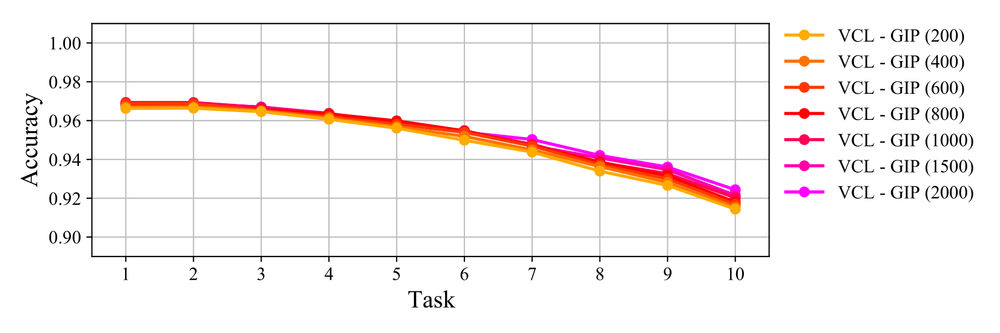

# Globally Induced Variational Continual Learning

The field of artificial intelligence has undergone a transformation, as advancements in deep learning continue to expand the horizons of what it can achieve. Although significant progress has been realised, artificial intelligence still falls short of human intelligence, most notably perhaps when it comes to continual learning. This is the ability to acquire knowledge not just of a single task but to accumulate knowledge from multiple sequential tasks, whilst only ever having access to the current task data. Variational continual learning implements this by leveraging the intrinsically continual process emerging from the recursive application of Bayesian inference, which combines what the current task data indicates about the model parameters, with what previous task data indicated about the model parameters. Naturally this can be combined with Bayesian neural networks which apply Bayesian inference over the model parameters, such that the wide variety of complex tasks typically solved by artificial neural networks, may also be solved in a continual setting. Typically exact Bayesian inference can’t be performed and instead an approximate inference scheme must be chosen. The objective of this project is to build on the work of variational continual learning, by merging it with the recent work of global inducing point variational inference. The hypothesis being that because global inducing points act as pseudo data points, they could behave as an episodic memory for the model, thereby increasing performance. Further detail can be found in the associated dissertation [1](Dissertation.pdf).

### Theory

Resulting from the intractable nature of the probability distributions occurring in Bayesian neural
networks, typically exact Bayesian inference can’t be performed and instead an approximate inference
scheme must be chosen. This can be either a stochastic approximation such as the sampling based Markov
chain Monte Carlo approximation [3] or an analytic approximation such as the variational based mean field
approximation [4]. Stochastic inference schemes are asymptotically exact but computationally expensive,
whereas analytic inference schemes are asymptotically inexact but computationally inexpensive, which
is crucial with ever larger data sets becoming necessary. As such analytic inference schemes are gaining
popularity amongst not only professionals implementing them but also amongst researchers developing
them. This has led to the recent development of a global inducing point variational inference scheme [5],
inspired by the local inducing point variational inference scheme used in deep Gaussian processes [6].
Creating a unifying inference scheme across both deep learning classes, which also displays properties
potentially ideal for continual learning.

Consequently the focus of this project is to investigate the feasibility and effectiveness of the global
inducing point variational inference scheme in a variational continual learning model. The mean field
variational inference scheme used in the variational continual learning research papers, assumes that the
joint distribution over the model parameters can be factorised out into independent distributions, thereby
averaging over the degrees of freedom and approximating the effect of model parameters on each other
by that of a single averaged effect. In contrast the global inducing point variational inference scheme,
defines a set of global inducing points, which act as pseudo data points in order to induce a distribution
over the model parameters. As the global inducing points act as pseudo data points, they could behave
as an episodic memory for the model, capturing the essential information of each task, refreshing the
model’s knowledge of them, thereby increasing performance.

|ANN|BNN|
|:-:|:-:|
|||

### Practice

|Standard|Permuted|
|:------:|:------:|
|||

### Results

|Results|
|:-----:|
||

|Evidence Lower Bound|Logistic Loss|Predictive Accuracy|
|:------------------:|:-----------:|:-----------------:|
||||